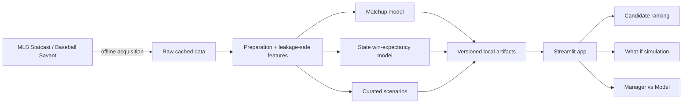

# THE HOOK — Architecture

Status: planned hackathon architecture  
Version: 1.0  
Last updated: 2026-08-08

## 1. Architecture goal

Use the smallest architecture that supports a credible, fast, offline Streamlit demo.

THE HOOK is a single Python application with an offline artifact-building pipeline. It has no separate backend, database, live API dependency, or production serving layer.

## 2. System context



Only the left side runs during artifact creation. During the demo, the Streamlit app reads local artifacts and performs lightweight vectorized simulation.

## 3. Runtime boundaries

### Offline build path

Responsible for:

- Acquiring and caching raw Statcast data.
- Converting pitch-level rows into terminal plate appearances.
- Constructing prior-only pitcher and batter profiles.
- Training and validating the matchup model.
- Training and validating the game-state win-expectancy model.
- Producing candidate probabilities for curated scenarios.
- Writing compact Parquet/JSON/joblib artifacts.

### Online app path

Responsible for:

- Loading immutable local artifacts.
- Validating scenario and feature schemas.
- Running 1,000–5,000 vectorized simulations.
- Ranking candidates.
- Producing template explanations.
- Rendering Streamlit components and Plotly charts.

The online path must not acquire data, train models, or call external APIs.

## 4. Recommended repository structure

```text
.
├── app.py
├── pages/
│   └── 1_How_It_Works.py
├── src/
│   ├── __init__.py
│   ├── config.py
│   ├── data/
│   │   ├── __init__.py
│   │   ├── acquire.py
│   │   ├── prepare.py
│   │   ├── schemas.py
│   │   └── scenarios.py
│   ├── features/
│   │   ├── __init__.py
│   │   └── profiles.py
│   ├── models/
│   │   ├── __init__.py
│   │   ├── matchup.py
│   │   ├── win_expectancy.py
│   │   └── explain.py
│   ├── simulation/
│   │   ├── __init__.py
│   │   ├── engine.py
│   │   └── transitions.py
│   └── ui/
│       ├── __init__.py
│       ├── components.py
│       ├── charts.py
│       └── theme.py
├── scripts/
│   ├── download_data.py
│   ├── build_artifacts.py
│   └── validate_artifacts.py
├── data/
│   ├── raw/
│   │   └── .gitkeep
│   ├── processed/
│   │   ├── plate_appearances.parquet
│   │   ├── pitcher_profiles.parquet
│   │   ├── batter_profiles.parquet
│   │   └── state_examples.parquet
│   └── scenarios/
│       └── scenarios.json
├── artifacts/
│   ├── matchup_model.joblib
│   ├── win_expectancy_model.joblib
│   ├── feature_schema.json
│   ├── model_metadata.json
│   ├── metrics.json
│   └── calibration.parquet
├── assets/
│   ├── logo.svg
│   └── screenshots/
├── tests/
│   ├── test_schemas.py
│   ├── test_transitions.py
│   ├── test_simulation.py
│   └── test_app_smoke.py
├── notebooks/
│   └── exploration.ipynb
├── .streamlit/
│   └── config.toml
├── .gitignore
├── requirements.txt
├── README.md
├── project_requirements.md
├── Architecture.md
├── rules.md
├── phases.md
├── design.md
└── memory.md
```

The folder structure is a target, not permission to create every file early. Each phase creates only what it needs.

## 5. Canonical data contracts

### 5.1 Plate appearance record

Minimum fields:

| Field | Type | Notes |
|---|---|---|
| `game_pk` | integer/string | Stable game identifier |
| `game_date` | date | Event date |
| `inning` | integer | 1 or greater |
| `inning_half` | enum | `TOP` or `BOTTOM` |
| `outs_before` | integer | 0–2 |
| `on_1b_before` | boolean | Base occupancy |
| `on_2b_before` | boolean | Base occupancy |
| `on_3b_before` | boolean | Base occupancy |
| `home_score_before` | integer | Pre-PA score |
| `away_score_before` | integer | Pre-PA score |
| `pitcher_id` | integer/string | MLB player identifier |
| `batter_id` | integer/string | MLB player identifier |
| `pitcher_hand` | enum | `L` or `R` |
| `batter_stand` | enum | `L`, `R`, or documented fallback |
| `event` | string | Original terminal event |
| `outcome_class` | enum | Four canonical model classes |
| `runs_scored` | integer | Derived from before/after score |
| `home_team_won` | boolean | Target for state WP model only |

Rows with ambiguous terminal events are excluded using a documented mapping.

### 5.2 Player profile

Each profile is explicitly keyed by player and cutoff date:

| Field | Meaning |
|---|---|
| `player_id` | MLB identifier |
| `as_of_date` | All underlying events precede this date/time |
| `pa_count` | Effective sample size |
| `k_rate_shrunk` | Strikeout rate pooled to league prior |
| `bb_rate_shrunk` | Walk/HBP rate pooled to league prior |
| `woba_shrunk` | Overall quality estimate |
| `platoon_metric_shrunk` | Optional pooled hand-split metric |
| `pitch_family_*` | Broad pitch-mix or matchup features |
| `avg_velocity` | Pitcher only where available |
| `pitches_last_3d` | Pitcher workload |
| `days_rest` | Pitcher workload |

No profile may include target-event or future information.

### 5.3 Curated scenario

`data/scenarios/scenarios.json` is the canonical scenario source.

```json
{
  "scenario_id": "stable-slug",
  "title": "Human-readable title",
  "is_flagship": true,
  "game_pk": 123456,
  "game_date": "2026-05-01",
  "as_of_timestamp": "2026-05-01T21:14:00Z",
  "batting_team": "NYY",
  "fielding_team": "BOS",
  "inning": 7,
  "inning_half": "TOP",
  "home_score": 3,
  "away_score": 2,
  "outs": 1,
  "bases": {"first": true, "second": true, "third": false},
  "current_pitcher_id": 1,
  "upcoming_batter_ids": [10, 11, 12],
  "actual_choice_id": 2,
  "candidate_reliever_ids": [1, 2, 3, 4],
  "decision_note": "Why this was a real decision point",
  "source_urls": ["https://example.com"],
  "manual_reviewed": true
}
```

Exact fields may be extended, but these semantics must not change without updating schema tests and `memory.md`.

### 5.4 Candidate result

The simulator returns one record per candidate:

| Field | Type |
|---|---|
| `scenario_id` | string |
| `candidate_id` | integer/string |
| `candidate_name` | string |
| `estimated_win_probability` | float 0–1 |
| `expected_runs_allowed` | nonnegative float |
| `delta_vs_actual` | signed float |
| `is_actual_choice` | boolean |
| `is_recommended` | boolean |
| `reasons` | ordered list of 1–3 strings |
| `simulation_count` | integer |
| `seed` | integer |

UI code consumes this contract and does not inspect scikit-learn objects directly.

## 6. Data preparation architecture

### 6.1 Acquisition

- Pull bounded date ranges with `pybaseball.statcast` in chunks.
- Cache each chunk immediately to Parquet.
- Maintain a small manifest containing date range, row count, acquisition time, and library version.
- A failed rerun must reuse valid existing chunks.
- Never download data when `app.py` starts.

### 6.2 Terminal plate appearances

- Identify the terminal pitch/event for each plate appearance.
- Map event strings into the four canonical classes.
- Derive pre-event score and base/out state.
- Remove rows that cannot be mapped confidently.
- Record exclusion counts in a build report.

### 6.3 Leakage-safe profiles

For training rows, create expanding or rolling player statistics sorted by event time and shifted by one event. Apply documented shrinkage to league priors.

For scenario inference, build profiles using only data before `as_of_timestamp`.

If point-in-time feature construction proves too slow, use monthly snapshots. A scenario uses the latest snapshot strictly before its date.

### 6.4 Scenario curation

Scenario selection is intentionally manual. Each case must be checked against source play-by-play and reviewed for:

- Correct state.
- Correct upcoming batting order.
- Correct actual managerial action.
- Plausible candidate availability.
- No future data in profiles.
- Clear demo narrative.

## 7. Matchup model architecture

### 7.1 Pipeline

Use a single scikit-learn `Pipeline`:

1. Column selection.
2. Missing-value imputation.
3. Standardization for numeric features.
4. One-hot encoding for categorical features.
5. Regularized multinomial logistic regression.

Persist the complete pipeline with joblib so inference transformations exactly match training.

### 7.2 Model outputs

For each pitcher–batter matchup, output:

`[P(OUT), P(FREE_PASS), P(SINGLE), P(EXTRA_BASE)]`

Probabilities must be nonnegative and sum to one within numerical tolerance.

### 7.3 Model fallback

If the trained model is unstable, slow, or no better than the baseline, use a pooled projection model:

1. Combine shrunk pitcher and batter event rates.
2. Apply a documented handedness adjustment.
3. Normalize to the four outcome classes.

The fallback is acceptable if it is validated, transparent, and produces more stable rankings.

Do not escalate immediately to gradient boosting.

## 8. State win-expectancy model

Train a simple logistic regression predicting whether the fielding team eventually wins from state features:

- Home/away indicator for the fielding team.
- Inning and inning-half.
- Score differential from fielding-team perspective.
- Outs.
- Base occupancy.
- Optional interactions: inning × score differential and base occupancy × outs.

Required sanity checks:

- Larger favorable score differential must not systematically reduce estimated WP.
- With other features fixed, later innings should magnify the effect of score differential.
- Outputs must remain in `[0, 1]`.

If ordinary logistic regression produces obvious non-monotonic artifacts through interactions, remove the interactions or use a smoothed empirical lookup. Do not add a complex model merely to improve fit.

## 9. Simulation architecture

### 9.1 Horizon

Simulate at most the next three hitters for the chosen reliever. Stop earlier if the half-inning reaches three outs.

After the horizon:

- Convert the resulting score, inning, outs, and bases into an estimated final win probability with the fixed state model.
- Average probabilities across simulations.
- Calculate mean runs allowed over the horizon.

### 9.2 Outcome transitions

The transition engine is a pure function:

`next_state = transition(current_state, sampled_outcome, extra_base_subtype, rng)`

MVP base advancement rules may be deterministic and documented:

- `OUT`: add one out; runners hold.
- `FREE_PASS`: force runners only when required.
- `SINGLE`: runners advance one base; runner on second scores.
- `DOUBLE`: runners advance two bases.
- `TRIPLE`: all runners score; batter to third.
- `HOME_RUN`: all runners and batter score.

This is a simplification. The same rules apply to all candidates, so relative comparisons remain meaningful. More realistic advancement is optional only after MVP completion.

### 9.3 Extra-base subtype

When `EXTRA_BASE` is sampled, choose double/triple/home run from a pooled conditional distribution. Prefer batter-quality- or hand-adjusted pooled rates if already available; otherwise use league rates.

### 9.4 Determinism and caching

- Derive the seed from a stable scenario ID, candidate ID, and control values.
- Cache ranking results by scenario and control values with `st.cache_data` or an equivalent pure Python cache.
- Keep the seed visible in metadata, not necessarily in the UI.

### 9.5 Ranking

Rank candidates by estimated win probability. Resolve ties within 0.1 percentage point by lower expected runs, then by stable candidate ID. Do not overstate tiny differences: UI copy should say choices are “effectively tied” when the top delta is below a configurable threshold such as 0.5 percentage point.

## 10. Explanation architecture

Explanation generation is deterministic:

1. Compare the selected candidate's profile with the scenario candidate pool.
2. Score a small approved set of reasons.
3. Select the strongest nonredundant 1–3 reasons.
4. Render a plain-language template.

Approved reason families:

- Handedness mix.
- Strikeout profile.
- Walk suppression.
- Overall contact quality/xwOBA.
- Pitch-family matchup.
- Workload/rest.

Every reason must be traceable to stored numbers. If no reason clears its evidence threshold, use a neutral explanation based on the combined projected outcome distribution.

## 11. Streamlit architecture

### Main app: `app.py`

- Page configuration and cached artifact loading.
- Hero and scenario selector.
- Situation card.
- Manager-vs-Model comparison.
- Candidate ranking.
- Reliever what-if panel.
- Assumption/limitation expander.

### Secondary page: `pages/1_How_It_Works.py`

- Data source and coverage.
- Four-outcome model diagram.
- Validation metrics and baseline.
- Calibration chart.
- Simulation simplifications.
- Limitations.

Shared rendering belongs in `src/ui/`; business logic must not be embedded in page layout code.

## 12. Configuration

Centralize tunable values in `src/config.py`:

- Data date range.
- Shrinkage constant(s).
- Simulation count.
- Tie threshold.
- Random-seed base.
- Artifact paths.
- Display precision.
- Approved outcome mapping version.

Model metadata records the actual values used to build artifacts.

## 13. Verification strategy

### Schema tests

- Required scenario fields exist.
- IDs referenced by scenarios exist in profile tables.
- Exactly one flagship scenario exists.
- Actual choice is part of candidate set.
- Candidate count is between 3 and 5.
- Probabilities are valid.

### Transition tests

Cover at least:

- Empty bases.
- Forced walk with bases loaded.
- Single with runner on second.
- Extra-base hit with occupied bases.
- Home run.
- Third out stops the half-inning.

### Simulation tests

- Fixed seed yields identical output.
- Simulation outputs stay within valid bounds.
- A synthetic clearly superior pitcher ranks above an inferior pitcher.
- All candidates use the same simulation horizon and state.

### Model checks

- No training row uses future profile data.
- Pipeline accepts scenario feature rows.
- Probabilities sum to one.
- Metrics artifact matches the persisted model version.

### App smoke test

- Artifact loader succeeds.
- All required scenarios render.
- Changing candidate returns a result.
- No network access is attempted.

Testing remains targeted; a large testing framework is out of scope.

## 14. Performance budget

| Operation | Target |
|---|---:|
| Load compact artifacts | < 5 seconds locally |
| Compute all candidate rankings after warm-up | < 2 seconds |
| Switch what-if candidate from cached ranking | < 300 ms |
| Render core page after data load | < 2 seconds |
| Total committed runtime artifacts | Prefer < 50 MB; investigate above 100 MB |

Reduce simulation count before adding architectural complexity.

## 15. Failure modes and fallbacks

| Risk | First mitigation | Fallback |
|---|---|---|
| Statcast pull is slow or unstable | Chunk and cache narrow dates | Commit a documented processed sample sufficient for scenarios/model |
| Too little player history | Add 2024 or strengthen shrinkage | Use role/league priors |
| Multiclass model is unstable | Reduce features and regularization search | Pooled projection model |
| State WP model is implausible | Remove interactions and inspect labels | Smoothed empirical state lookup |
| Simulation is slow | Vectorize and cache | Reduce to 1,000 runs |
| Candidate rankings look implausible | Inspect scenario profiles and outcome mapping | Remove weak feature; do not hand-edit results |
| Streamlit deployment exceeds limits | Reduce artifact columns/precision | Ship only scenario-specific inference artifacts |
| Explanation contradicts numbers | Tighten approved reason thresholds | Use neutral combined-projection explanation |

## 16. Dependency policy

Preferred direct dependencies:

- `streamlit`
- `pandas`
- `numpy`
- `scikit-learn`
- `plotly`
- `pyarrow`
- `joblib`
- `pybaseball` for offline acquisition only
- `pytest` for targeted verification

Add no dependency unless it saves meaningful implementation time or is required for correctness.

## 17. Architectural decisions frozen for MVP

- Single Streamlit application.
- Offline data and model build.
- No runtime network calls.
- Curated scenarios, not a universal browser.
- Four-outcome regularized multinomial model with a pooled fallback.
- Short three-batter simulation horizon.
- Simple state win-expectancy model.
- Deterministic template explanations.
- Targeted tests and manual scenario review.

Changes to these decisions require a documented reason in `memory.md` and must improve completion probability, correctness, or the demo—not architectural sophistication.
