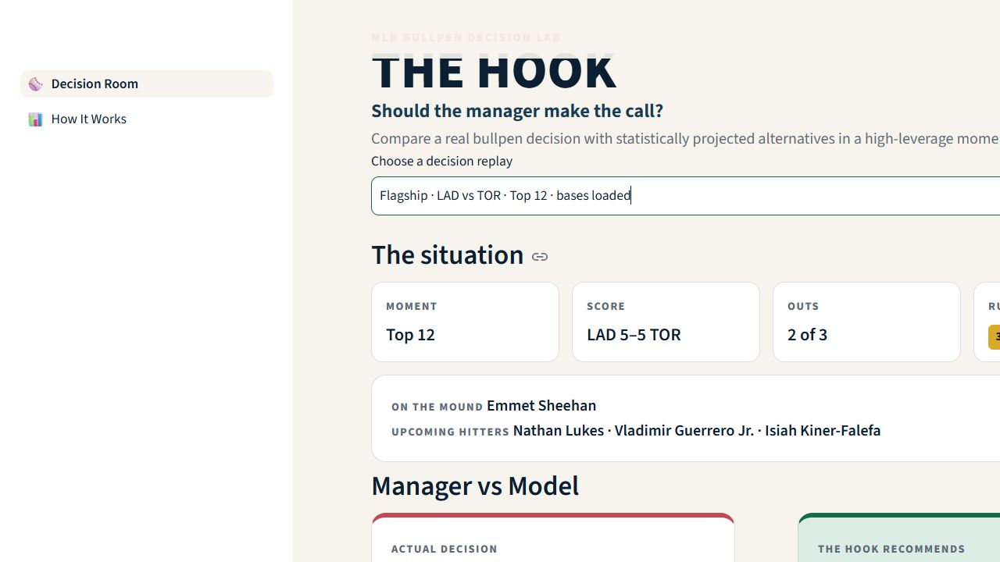
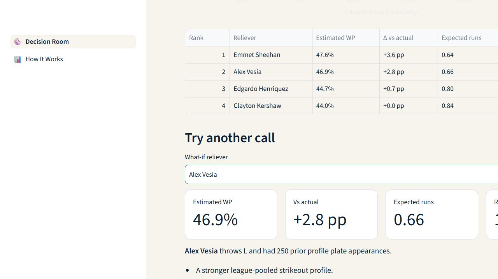
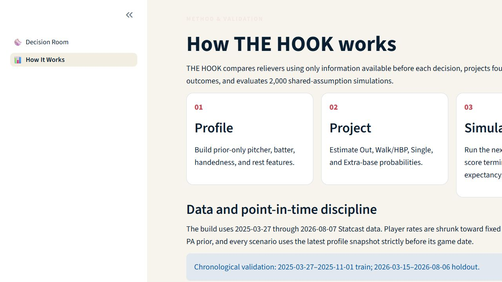

# THE HOOK

> An explainable MLB bullpen decision simulator for the moment when one call can change the game.

THE HOOK replays three verified, high-leverage MLB pitching changes. It compares the manager's real choice with plausible alternatives, estimates each reliever's win probability under identical assumptions, and explains the recommendation in plain language.

Built for the [AQX Sports Analytics Data Bowl 3.0](https://aqxanalyticsthree.devpost.com/).

**Live demo:** [the-hook.streamlit.app](https://the-hook.streamlit.app/)

**Source:** [github.com/Harshyadav442277/the-hook](https://github.com/Harshyadav442277/the-hook)



<details>
<summary>More screenshots</summary>

### Reliever what-if



### Method and validation



</details>

## The decision

It is the 12th inning of Game 3 of the 2025 World Series. The bases are loaded, there are two outs, and the Dodgers need one more out to preserve a 5–5 tie.

The manager chose **Clayton Kershaw**. THE HOOK recommends **Emmet Sheehan** and estimates a **+3.6 percentage-point** win-probability advantage under the same simplified three-hitter model. The result is driven by Sheehan's stronger prior-only strikeout and projected out profiles against the upcoming hitters.

This is a comparative estimate—not proof of the unobserved counterfactual.

## What you can do

- Open directly into the flagship Manager-vs-Model decision.
- Switch among three official-feed-verified historical situations.
- Compare 3–5 plausible relievers on estimated WP and expected runs.
- Select any reliever for a synchronized what-if explanation.
- Inspect the chronological validation, calibration, assumptions, and limitations.

## How it works

1. **Profile:** Statcast plate appearances become pitcher and batter snapshots using only earlier events. Small samples are pooled toward fixed league priors with a 200-PA prior.
2. **Project:** A regularized multinomial logistic model estimates `OUT`, `FREE_PASS`, `SINGLE`, and `EXTRA_BASE` probabilities for each pitcher–batter matchup.
3. **Simulate:** THE HOOK runs 2,000 deterministic trials over at most the next three hitters. A chronological game-state model evaluates each terminal state.
4. **Explain:** Deterministic templates select evidence-backed differences in projected outs, strikeouts, walks, wOBA, and rest.

All deployed data and predictions are local artifacts. The app makes no network request and performs no training at runtime.

## Validation

Training uses 2025 plate appearances; the untouched chronological holdout covers 2026 through August 6.

| Metric | Model | Baseline | Interpretation |
|---|---:|---:|---|
| Four-outcome log loss | **0.9645** | 0.9700 | Modest improvement over pooled league rates |
| On-base Brier score | **0.2174** | — | Lower is better; calibration is shown in-app |
| State-model log loss | **0.4743** | 0.6927 | Strong improvement over constant win rate |

The state model also passes controlled checks that a better score differential increases estimated WP and that score effects become larger in later innings.

## Data and provenance

- Source: MLB Statcast / Baseball Savant, acquired offline with `pybaseball`.
- Window: 2025-03-27 through 2026-08-07.
- Raw input: 1,274,390 pitch rows.
- Modelable terminal plate appearances: 324,435.
- Documented exclusions: 3,321 ambiguous/error terminal events; no unknown event remains.
- Scenario facts: verified against official MLB Stats API play-by-play; sources are embedded in `data/scenarios/scenarios.json`.

MLB names, game facts, and Statcast data belong to their respective owners. This independent educational prototype is not affiliated with or endorsed by MLB.

## Run locally

Python 3.12 is recommended.

```powershell
python -m venv .venv
.venv\Scripts\python -m pip install -r requirements.txt
.venv\Scripts\streamlit run app.py
```

The committed runtime artifacts are sufficient; no Statcast download is needed.

For tests and a full offline rebuild:

```powershell
.venv\Scripts\python -m pip install -r requirements-dev.txt
.venv\Scripts\python -m pytest -q
.venv\Scripts\python scripts\download_data.py --start-date 2025-03-27 --end-date 2026-08-07 --chunk-days 7
.venv\Scripts\python scripts\build_phase2.py
.venv\Scripts\python scripts\verify_scenarios.py
.venv\Scripts\python scripts\train_models.py
.venv\Scripts\python scripts\build_runtime_artifacts.py
```

Raw Statcast data is intentionally excluded from Git. The download and scenario-verification steps require internet access; the app does not.

## Repository map

```text
app.py                         Decision Room
pages/1_How_It_Works.py       Method and validation page
src/data/                     Acquisition, schemas, preparation, scenarios
src/features/                 Prior-only pooled player profiles
src/models/                   Matchup, state, runtime, explanations
src/simulation/               Pure transitions and vectorized simulation
src/ui/                       Shared components, charts, visual tokens
artifacts/                    Small deployable models, metrics, scenarios
scripts/                      Reproducible offline pipeline and validation
tests/                        Data, leakage, simulation, artifact, app tests
reports/                      Auditable build and source-review evidence
submission/                   Devpost copy, demo script, and judge Q&A
```

## Limitations

- A counterfactual model cannot observe what would actually have happened.
- Bullpen availability, injury, warm-up status, defense, and pitch sequencing are simplified.
- Base advancement is deterministic within each sampled outcome class.
- The modeled horizon ends after three hitters or the third out.
- Absolute win probability is approximate; relative candidates share assumptions.
- Player samples are shrunk toward league averages and may miss rapid changes in form.

THE HOOK should support analysis and discussion, not replace a manager's full-context judgment.

## License

Code is released under the [MIT License](LICENSE). Data and MLB marks are not covered by that license.
