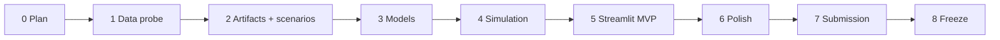

# THE HOOK — Phased Execution Plan

Status: orchestrator plan  
Version: 1.0  
Last updated: 2026-08-08  
Submission-safe target: end of 2026-08-15 IST

## 1. How to use this plan

Execute one phase at a time. Later implementation turns should use high reasoning and explicitly name the phase to execute.

Recommended phase prompt:

> Execute Phase N only. Read `memory.md`, `rules.md`, the Phase N section in `phases.md`, and the relevant requirements/architecture/design sections. Implement and verify every exit criterion, update `memory.md`, then stop.

Do not begin a later phase merely because time remains in the current turn. A phase may be combined with the next only if the user explicitly asks and the first phase's exit gate has passed.

## 2. Timeline overview

| Phase | Target date | Outcome |
|---|---|---|
| 0. Planning freeze | Aug 8 | Canonical plan and rules |
| 1. Foundation and data probe | Aug 8–9 | Runnable skeleton and verified Statcast sample |
| 2. Data artifacts and scenarios | Aug 9–10 | Clean PA/profile/state data and 3 curated cases |
| 3. Models and validation | Aug 10–11 | Persisted matchup and win-expectancy models |
| 4. Simulation and explanations | Aug 11–12 | Tested candidate ranking engine |
| 5. Core Streamlit MVP | Aug 12–13 | Complete flagship demo path |
| 6. Scenario coverage and polish | Aug 13–14 | 3 excellent scenarios and finished visual system |
| 7. Submission package and deployment | Aug 14–15 | Public-ready repository, deployed app, demo assets |
| 8. Buffer and freeze | Aug 15 | Final QA and early submission |

Dates are coordination targets, not permission to skip gates.

## 3. Cross-phase critical path

The critical path is data → model → simulator → Manager-vs-Model UI. README prose, optional graphics, and extra scenarios must never block it.

---

## Phase 0 — Planning freeze

### Objective

Create the canonical planning package and freeze the MVP boundary.

### Deliverables

- `project_requirements.md`
- `Architecture.md`
- `rules.md`
- `phases.md`
- `design.md`
- `memory.md`

### Exit criteria

- Documents agree on the product question and required scope.
- Model, simulation, data, UI, and phase contracts are explicit.
- MVP, optional, and prohibited work are separated.
- Phase 1 has no unresolved blocker.

### Status

Complete as of 2026-08-08. All six documents were created and cross-checked.

---

## Phase 1 — Foundation and data probe

### Objective

Prove that the chosen Python stack and minimum Statcast fields work before committing to a large data build.

### In scope

1. Inspect available Python runtime and package compatibility.
2. Create only the minimal repository skeleton needed by this phase.
3. Add `.gitignore`, `requirements.txt`, configuration, and package initializers.
4. Implement a bounded/chunked data acquisition script.
5. Pull a small sample date range.
6. Verify terminal-event, score, inning, base, handedness, pitcher, batter, pitch-type, and workload-related fields.
7. Write a short machine-readable or Markdown data probe report.
8. Add initial outcome mapping and schema tests.

### Out of scope

- Full-period download.
- Model training.
- Scenario research beyond identifying candidates.
- Streamlit UI.
- Deployment.

### Required decisions

- Python version and compatible direct dependencies.
- Whether `pybaseball` acquisition is reliable in the environment.
- Exact date range for Phase 2: default 2025 + 2026 YTD; 2024 only with evidence.
- Raw-cache format and manifest fields.
- Canonical terminal-event mapping.

### Verification

- Sample acquisition can be rerun without redownloading valid cache.
- Sample contains enough fields to construct the canonical PA record.
- At least 95% of terminal baseball events in the sample map to an approved outcome or a documented exclusion.
- Schema tests pass.
- No runtime app code makes network calls.

### Exit criteria

- A cached sample exists.
- Data feasibility is proven or a documented processed-data fallback is selected.
- Phase 2 date window is frozen.
- `memory.md` records findings, commands, and any schema changes.

### Timebox

Half to one working day. If acquisition blocks longer, use the simplest documented fallback rather than spending another day debugging the library.

---

## Phase 2 — Data artifacts and curated scenarios

### Objective

Produce compact, point-in-time-safe datasets and three verified historical decision situations.

### In scope

1. Acquire the approved bounded data window in restartable chunks.
2. Build the clean terminal-PA table.
3. Derive pre-event base/out/score states.
4. Build leakage-safe, shrunk pitcher and batter profiles.
5. Build training examples for the state win-expectancy model.
6. Research and encode one flagship plus two additional high-leverage situations.
7. Verify actual choice, upcoming hitters, and plausible candidate set for each scenario.
8. Write processed artifacts and build-quality report.

### Scenario selection rubric

Choose cases scoring well on:

- Obvious high leverage.
- At least two plausible reliever choices.
- Understandable without detailed baseball history.
- Interesting Manager-vs-Model result, whether agreement or disagreement.
- Complete, verifiable data.
- Variety in handedness/base/out state without forcing diversity.

Do not select a case because the unvalidated model happens to produce a dramatic result.

### Out of scope

- Final model tuning.
- Simulation engine.
- Streamlit UI.
- Fourth/fifth scenarios.

### Verification

- Processed PA row counts reconcile with raw input and exclusions.
- Profiles are prior-only and contain documented sample sizes.
- No scenario profile includes data on or after its cutoff.
- Every referenced player exists or has an explicit fallback profile.
- Exactly one scenario is flagged as flagship.
- Actual choice belongs to each candidate set.
- Each candidate set contains 3–5 players.
- Scenario facts are manually reviewed and source-linked.

### Exit criteria

- `plate_appearances.parquet`, profile tables, state examples, and `scenarios.json` exist and validate.
- Three scenarios pass manual and automated checks.
- Data build is reproducible from scripts or a documented cached source.
- Artifact sizes are compatible with deployment expectations.

### Timebox

One to one-and-a-half working days. If the third scenario is difficult, complete the flagship data first but do not start UI polish before all three scenario records are valid.

---

## Phase 3 — Models and compact validation

### Objective

Create the simplest defensible matchup and game-state models that produce stable, plausible probabilities.

### In scope

1. Implement league-rate baseline.
2. Train regularized four-outcome multinomial logistic pipeline.
3. Train simple state win-expectancy logistic model.
4. Use chronological holdout.
5. Compute and persist metrics.
6. Produce one on-base reliability/calibration dataset and chart-ready artifact.
7. Run sanity checks on model probabilities and state-WP behavior.
8. Persist models, feature schema, metadata, metrics, and class ordering.

### Model selection rule

Use minimal regularization selection on training data only. Do not start a broad hyperparameter search. Keep logistic regression unless:

- It is measurably worse than the pooled baseline,
- It produces unstable scenario rankings, or
- It violates obvious sanity checks after feature correction.

If it fails, use the pooled projection fallback before considering another learned model.

### Out of scope

- Gradient boosting by default.
- SHAP.
- Research-paper uncertainty.
- UI integration beyond an optional console report.

### Verification

- Chronological split dates are printed in metadata.
- Matchup probabilities sum to one.
- Holdout metrics and baseline metrics are persisted.
- On-base calibration bins contain valid counts and rates.
- State-WP output responds sensibly to controlled score/inning examples.
- Scenario inference rows match the persisted feature schema.
- No holdout data influenced preprocessing fit.

### Exit criteria

- Both inference artifacts load in a fresh process.
- Metrics support appropriately modest claims.
- All three scenarios receive valid candidate–batter probability matrices.
- Manual review finds no obvious reversed handedness or workload feature.
- Model version and assumptions are logged in `memory.md`.

### Timebox

One working day. Prefer a stable baseline by the end of the day over a marginally better unfinished model.

---

## Phase 4 — Simulation, ranking, and explanations

### Objective

Turn model probabilities into a deterministic, tested Manager-vs-Model result independent of Streamlit.

### In scope

1. Implement immutable/pure game-state representation.
2. Implement base/out transitions for four outcome classes and XBH subtype.
3. Implement vectorized three-batter simulation.
4. Apply the state win-expectancy model to terminal simulated states.
5. Compute expected runs and estimated WP.
6. Rank candidates and compute delta versus actual.
7. Handle effective ties.
8. Generate deterministic template explanations.
9. Expose a clean function returning canonical candidate-result records.
10. Add transition, determinism, bounds, and synthetic-ranking tests.

### Out of scope

- Streamlit components.
- Elaborate baserunning probabilities.
- Full-inning or full-game player-level simulation.
- Confidence intervals presented as total uncertainty.

### Verification

- Every transition edge case in `Architecture.md` passes.
- Fixed inputs and seed return identical results.
- Candidate order is stable across repeated runs.
- Synthetic superior/inferior profiles rank as expected.
- 2,000 simulations × 5 candidates completes within the performance budget on the available machine.
- All displayed reasons correspond to stored feature comparisons.
- A tiny top-two delta triggers effective-tie language.

### Exit criteria

- A command-line or test invocation prints complete rankings for all three scenarios.
- Manager-vs-Model records are available without importing Streamlit.
- Simulation count is frozen based on benchmark.
- Required tests pass.

### Timebox

One working day. Simplify base advancement before reducing correctness or introducing precomputed fake results.

---

## Phase 5 — Core Streamlit MVP

### Objective

Build the complete 60–90 second experience around the flagship scenario.

### In scope

1. Create Streamlit configuration and theme tokens.
2. Load artifacts with caching and friendly error handling.
3. Implement hero and scenario selector.
4. Implement situation card.
5. Implement Manager-vs-Model comparison above the fold.
6. Implement candidate ranking chart/table.
7. Implement what-if candidate selector and detail card.
8. Add concise explanation and assumptions expander.
9. Create the How It Works page with real metrics and calibration plot.
10. Add smoke coverage for the flagship flow.

### Build order

1. Unstyled working data flow.
2. Correct state synchronization.
3. Manager-vs-Model hierarchy.
4. Ranking and what-if interaction.
5. Theme and copy.

### Out of scope

- Extra scenarios beyond loading the existing three.
- Optional visuals.
- Screenshots, video, and Devpost copy.
- Custom JavaScript components.

### Verification

- Fresh launch defaults to the flagship scenario.
- No control selection produces stale results from another scenario.
- Actual and recommended choice labels are correct.
- Delta math uses percentage points.
- What-if changes every dependent display consistently.
- Methodology values come from persisted metadata, not hard-coded marketing copy.
- No network call occurs.
- Core path works at common laptop width.

### Exit criteria

- A reviewer can complete the flagship Manager-vs-Model demo in under 90 seconds.
- No raw errors appear during the path.
- Warm updates meet the performance budget.
- How It Works accurately reflects the model.

### Timebox

One working day. Do not spend the first half on custom CSS.

---

## Phase 6 — Scenario coverage and visual polish

### Objective

Make all required scenarios excellent, unify visual design, and remove demo friction.

### In scope

1. Exercise the complete UI flow for all three scenarios.
2. Review every ranking and explanation for plausibility.
3. Apply the design system from `design.md` consistently.
4. Tighten copy, labels, spacing, and chart annotations.
5. Add empty/error/loading states.
6. Check contrast and non-color labels.
7. Benchmark cold/warm behavior and reduce artifact/runtime weight if needed.
8. Add a fourth scenario only if all required gates already pass and time remains.

### Out of scope

- Fundamental model redesign unless a correctness bug is found.
- Fifth scenario before the fourth is fully reviewed.
- Large new controls.
- Production hardening.

### Verification

- All three scenarios complete the full path.
- The default page communicates the problem in 10 seconds.
- Manager-vs-Model remains visually dominant.
- Charts use honest scales and consistent colors.
- Text never makes a stronger claim than the evidence.
- No section overwhelms a laptop viewport with unnecessary detail.
- Manual demo rehearsal requires no hidden setup.

### Exit criteria

- MVP scope is frozen.
- Required scenarios are visually and analytically reviewed.
- Optional backlog is explicitly closed or deferred.
- Screenshots can be taken without further layout changes.

### Timebox

One working day. At its end, feature development stops.

---

## Phase 7 — README, deployment, and submission package

### Objective

Make the project reproducible, publicly understandable, and ready for Devpost.

### In scope

1. Write and verify README.
2. Pin direct dependencies and clean repository contents.
3. Verify setup from a clean environment.
4. Deploy to the approved Streamlit host after user authorization.
5. Test the deployed app in a clean browser session.
6. Capture 3–5 screenshots.
7. Write Devpost description.
8. Finalize the 60–90 second demo script.
9. Rehearse basic judging questions and answers.
10. Prepare attribution and limitations.

### README structure

1. Hero/title and one-line value proposition.
2. Live demo link and screenshots.
3. The decision problem.
4. Manager-vs-Model example.
5. Feature overview.
6. How the model works.
7. Simulation simplifications.
8. Validation results.
9. Data source and attribution.
10. Local setup and artifact usage.
11. Repository structure.
12. Limitations and responsible interpretation.
13. Team/acknowledgments.

### Demo script baseline

**0–10 seconds — Problem**

> “It is the seventh inning, runners are on, and the next three hitters can decide the game. THE HOOK answers one question: who should the manager bring in right now?”

**10–25 seconds — Situation**

Point out the score, outs, bases, current pitcher, upcoming hitters, and real managerial choice.

**25–45 seconds — Recommendation**

> “The manager chose [A]. THE HOOK recommends [B], with an estimated [X.X]-percentage-point advantage under the same assumptions.”

Show the top two evidence-based reasons.

**45–65 seconds — Interaction**

Select a different reliever and show the updated WP, expected runs, and explanation.

**65–80 seconds — Credibility**

> “The estimates come from recent Statcast data, a regularized outcome model, and 2,000 short-horizon simulations. We validate chronologically and pool small samples toward league averages.”

**80–90 seconds — Close**

> “THE HOOK turns a high-pressure bullpen decision into a comparison a manager, analyst, or fan can understand immediately.”

Use actual names and validated numbers only after the MVP is frozen.

### Verification

- Clean setup instructions work.
- Deployment needs no raw-data build or runtime network request.
- Public repository contains no secrets, unnecessary raw data, or private files.
- Live URL passes every required scenario.
- README metrics match artifacts.
- Screenshots show real app state.
- Demo stays under 90 seconds in two consecutive rehearsals.
- Devpost fields satisfy official requirements.

### Exit criteria

- Submission package is complete and reviewed.
- Deployment is stable.
- User has everything needed to submit.
- `memory.md` records final artifact/model versions and URLs.

### Timebox

One working day, finishing before the safe internal deadline.

---

## Phase 8 — Buffer and final freeze

### Objective

Use the final buffer only for correctness, reliability, and submission—not features.

### Allowed work

- Fix broken links, crashes, stale state, misleading copy, or deployment failures.
- Reduce data/artifact size.
- Correct README or Devpost inconsistencies.
- Retake a screenshot after a bug fix.
- Rehearse and submit after user authorization.

### Forbidden work

- New model family.
- New scenario unless replacing a broken required scenario.
- New page.
- New major chart or control.
- Visual redesign.

### Final checklist

- [x] Three scenarios pass.
- [x] Flagship opens by default.
- [x] Actual/recommended choices are correct.
- [x] Percentage-point delta is correct.
- [x] What-if state is synchronized.
- [x] Model and metrics artifacts match.
- [x] Limitations are visible.
- [x] Repository is public and clean, if authorized.
- [x] Live app is tested, if authorized.
- [x] README and Devpost copy agree.
- [x] Demo is under 90 seconds.
- [ ] Submission is completed before the official deadline.

## 4. README and submission cut policy

If behind on August 14:

- Keep three scenarios, but allow two to have lighter narrative polish.
- Use a static calibration image/artifact rather than building a sophisticated report.
- Skip optional video.
- Skip fourth/fifth scenarios.
- Skip custom logo work.
- Preserve deployed stability, README accuracy, screenshots, and Manager-vs-Model.

## 5. Technical risk register

| Risk | Detection phase | Simplest mitigation | Escalation threshold |
|---|---|---|---|
| `pybaseball` acquisition fails | 1 | Chunk/retry/cache; use bounded documented CSV | More than half a day blocked |
| State fields cannot be reconstructed | 1–2 | Use terminal PA score/base fields or smaller verified state table | Flagship state cannot validate |
| Point-in-time profiles are expensive | 2 | Monthly prior-only snapshots | Build cannot finish in practical time |
| Model no better than baseline | 3 | Use pooled projection and narrow claims | Sanity/metric failure persists |
| State WP model behaves oddly | 3 | Remove interactions or smoothed lookup | Monotonic sanity tests fail |
| Simulator too slow | 4 | Vectorize/cache/reduce to 1,000 | Warm ranking > 2 seconds |
| Scenario candidates not actually available | 2/6 | Replace candidate or document curated eligibility | Source check fails |
| Rankings are nearly tied | 4/6 | Use honest tie language; choose a stronger flagship if independently valid | No scenario has a clear story |
| Deployment artifact too large | 6–7 | Keep scenario-specific inference artifacts only | Host fails/restarts |
| UI polish consumes schedule | 5–6 | Apply tokens after functional flow | Core flow not done by Phase 5 midpoint |

## 6. Orchestrator reporting format

At each phase handoff, report:

1. Phase outcome.
2. Exit criteria passed/failed.
3. Files and artifacts created.
4. Tests/checks run with results.
5. Durable decisions added to `memory.md`.
6. Known risks for the next phase.
7. Exact next phase to execute.

Do not describe a phase as complete when any required exit criterion remains open.
